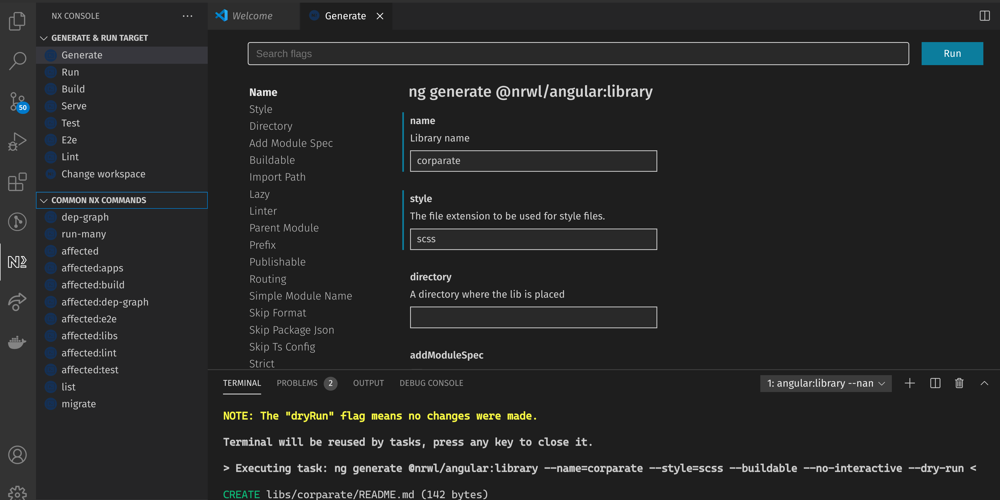

# Nx und Monorepo

## Was ist NX?

Nx ist eine Erweiterung und Aufsatz auf das Angular Command Line Interface (Angular CLI).
Es stellt einen Workspace bereit und bietet Werkzeuge um zum Beispiel Code zu generieren,
das Build-System zu bedienen, oder aber auch Tests zu starten.

Zusätzlich bietet Nx Werkzeuge, um Abhängigkeiten innerhalb des Projekts zu steuern
und eine Möglichkeit die Verwendungen von Code mittels Constraints einzuschränken.

## Was ist ein Monorepo?

Anstatt jedes Projekt in ein eigenes Repository zu legen, werden mehrere Teilprojekte in
demselben Repository abgelegt.

### Vorteile:

- Einfachere Wiederverwendung von Quellcode, da keine Versionen als Artefakt veröffentlicht werden müssen.
- Bessere Verwaltung von Abhängigkeiten auf Fremd-Bibliotheken da diese für alle Teilprojekte gleich sind
- Atomare Commits, bei denen Änderungen über alle Teilprojekte hinweg durchgeführt werden
- Teamübergreifende Zusammenarbeit über Projektgrenzen hinweg

### Nachteile:

- Sichtbarkeit kann nicht pro Teilprojekt gesteuert werden. Zugriff aufs Repository bedeutet Lese- bzw. Schreibrechte 
  auf dem gesamten Quellcode.
- Nicht alle Build-Systeme unterstützen Monorepos und werden langsamer als separat gebaute Projekte.

## Monorepo mit NX

Es werden Angular Anwendungen und Bibliotheken in einem Repository abgelegt. Da es nur eine *package.json* für das
gesamte Projekt gibt, erzwingen wir die Verwendung einer einheitlichen Version unserer Abhängigkeiten.

Geeignet sind NX Workspaces um Teilprojekte zusammenzufassen oder Projekte mit einer ähnlichen Domäne.

### Umgebung mit NX einrichten

```bash
npx create-nx-workspace@latest
```

Im interaktiven Teil des CLI vergeben wir den Namen des Workspace mit `rail` und wählen das Preset `Angular` aus.
Der Name des Projekts wird mit `prototype` angegeben. Anschließend ist im neu erzeugten Ordner *rail* unser 
NX-Monorepo zu finden.

Eine grundlegende Idee von NX ist es die Anwendungen zu modularisieren. Dabei werden die Module als Bibliotheken
abgebildet und in einer der Apps orchestriert.

### NX-Console

Die NX-Console ist eine Erweiterung für Visual Studio Code und bietet eine UI um mit NX zu interagieren. Von dem Tool
wird die entsprechenden Kommandozeilen generiert und auch ausgeführt. Um die Beispiele einfach zu halten werden nur
die sich ergebenden Kommandos aufgeführt.



### Bibliotheksprojekt erzeugen

Um Code in Bibliotheken auslagern zu können, müssen wir so eine erzeugen. Hierfür bietet sich das Schematic 
`@nrwl/angular:library` an. Bei der Erzeugung sollte schon entschieden werden, ob die Bibliotheken nur innerhalb
des Monorepo verwendet werden sollen oder aber auch per npm veröffentlicht. Ein nachträglicher Wechsel ist nicht
einfach möglich. Im Beispiel verwenden wir das *--buildable* Flag, um die Bibliothek später per npm zur Verfügung
zu stellen.

```bash
ng generate @nrwl/angular:library --name=corporate --style=scss --buildable --no-interactive
ng generate @nrwl/angular:library --name=trains --style=scss --buildable --no-interactive
ng generate @nrwl/angular:library --name=admin --style=scss --buildable --no-interactive
ng generate @schematics/angular:component --name=header --project=corporate --style=scss --export --no-interactive 
ng generate @schematics/angular:component --name=train --project=trains --style=scss --export --no-interactive 
ng generate @schematics/angular:component --name=dashboard --project=admin --style=scss --export --no-interactive 
```

Binde das *CorporateModule* im App-Modul ein. Implementiere eine Navigationsleiste in der *HeaderComponent*.
Analog dazu werden die Module der anderen beiden Bibliotheken importiert. Wir erzeugen jeweils eine Route.

### Abgrenzungen von Abhängigkeiten

Um zu vermeiden, das jedes Teilprojekt beliebig Code aus anderen Teilen importieren kann,
können wir Constraints setzen. Jedes Projekt kann in der `nx.json` Datei Tags besitzen. In 
der `ts-lint.json` können diese genutzt werden, um den Import auf bestimmte Tags zu beschränken.

Füge in der nx.json zu jedem Teilprojekt ein Tag ein. Für die Anwendung verwende den Tag
`scope:client` und für die Bibliothek *corporate* `scope:shared`. Für die beiden anderen Libraries 
verwenden wir einen Tag `scope:` gefolgt von ihrem Namen.

Erweitere in der `ts-lint.json` die Einschränkung des Imports so, dass Projekte mit dem Tag `scope:shared`
nur aus Projekten mit dem Tag `scope:shared` importieren dürfen. Die Anwendungen dürfen auch nur aus dem
Scope `scope:shared` und `scope:client` importieren.
